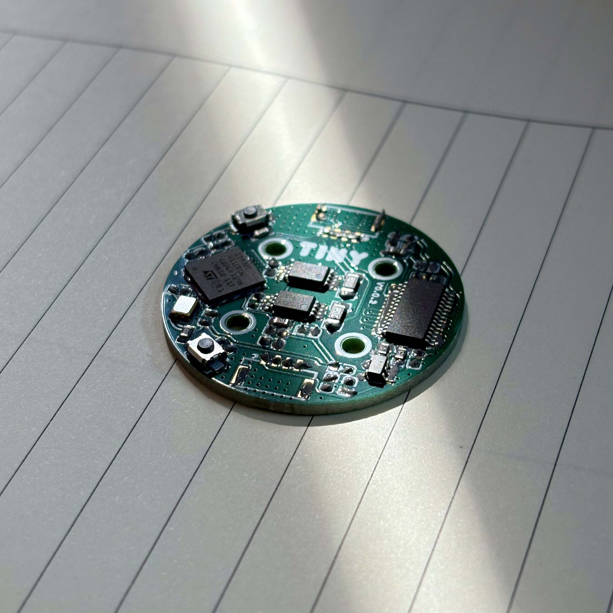

# TinyFOC使用教程



>  说明: 因为现在网络上优秀的FOC教程已经很多了,所以以下内容不涉及FOC具体原理, 主要讲解具体实现, 帮助大家更轻松快速地将理论投入实践.

# CubeMX配置篇

## TIM配置

### 输出模式

首先是配置定时器的模式为PWM发生模式; 这么配置是因为项目使用了DRV8313一体集成驱动芯片,内部含有三个半桥电路,并且自带死区补偿功能,能够有效防止上下半桥同时导通导致电源短路,同时也减小了芯片配置与程序编写的难度,唯一的缺点就是芯片持续工作电流较小,因此只能用于小型云台电机控制中;如果后续有控制大电流BLDC的需求,电路上半桥电路要使用分立的MOS管实现,定时器则要使用到互补PWM输出,并且根据MOS的导通时间与开关频率去配置死区时间.

### 计数模式

软件上使用的七段式SVPWM,而定时器中心对齐模式能够完美实现其需要的波形;关于中心对齐模式 1,2,3 的区别在于定时器的更新事件产生时刻, 这决定了 ADC 的采样时机.

- mode1: 在计数器向下计数溢出时, 触发中断, 即完成一个完整的 V 形周期后产生.
- mode2: 在计数器向上计数溢出时, 触发中断, 即在 V 形周期顶峰产生.
- mode3: 在上和下计数溢出时都会触发中断, 每个 PWM 周期产生两次中断.

本项目中选择的式中心对齐模式3,配合定时RCR使用

### 关于重复计数器RCR

其作用是将高级定时器产生的中断事件进行分频,避免频发触发定时器的Update Event;中断频率可以通过以下公式计算:


本项目中使用RCR是为了配合ADC采样和电流环执行, 保证在执行电流环的时候能获取到clean的电流值并能够防止直接使用定时器的Update Event导致程序跑飞.

### PWM频率配置

计算时要注意: 由于是中心对齐模式, 所以一个周期的时钟数 = 2 * (ARR + 1) * PSC.  
PWM 频率配置建议在 20KHz 以上, 这样可以避开人的听觉范围, 消除电机啸叫;  
PWM 频率也不能太高, 避免 MOS 的频繁开断造成的开关损耗;

## ADC配置

项目使用的STM32F411内部只有一个ADC外设,因此要开启扫描转换模式;通常使用ADC的常规模式来对电池电压和电机温度等实时性不高的数据进行采样, 通过注入模式来响应定时器的更新事件来对相电流进行采样,这里因为没有对系统参数测量的需求,所以不需要配置常规转换模式,只需要将两个ADC通道在注入转换模式中配置为外部定时器触发,设置一个合理的采样时间.

## IIC配置

I2C的速度要开启Fast Mode,因为要在1KHz以上的PIT中断高速读取编码器,太慢了容易卡死在中断.

## 添加Middleware

程序中使用到了查表法计算正弦余弦函数,因此要使用官方的DSP库,需要大家在Middleware中自行下载添加.

# 代码篇

### **Tree**

```text
└─TinyFOC
    ├─Core
    │  ├─Inc
    │  └─Src
    ├─Drivers
    ├─MDK-ARM
    ├─Middlewares
    └─User
        ├─AS5600
        ├─FOC
        ├─MATH
        └─VOFA
```

程序算法执行上使用了5KHz的频率执行电流环,1KHz的频率执行速度环和位置环,速度和位置环的内环使用的都是电流环,与下图实现有些许差异,直接使用电流环作为位置环内环是为了获得更高的刚度并提供极快的动态响应,减小相位延迟.

### 关于电角度对齐

使用的是`foc_alignSensor(<param>)`函数,其参数是对齐电压,如果电压太大会导致过冲振荡,太小会导致对齐不准,这些都会导致对齐失败,使电机失控;我的建议是将对齐电压控制在2~4V之间,如果想进一步增强鲁棒性,可以在函数内部增加延时时间.


### 关于电机配置

通常2804的云台电机极对数是7对,不过还是要留意一些;  
因为在电机和驱动板连线时不能保证UVW相是完全对应的,如果运行时发现出现电机工作异常,可以尝试将dir在正1或负1;  
电机的供电电压最好使用12V.

### 关于采样

如果你使用的是INA240A2则要将OP_GAIN修改为50;  
ADC的参考电压最好使用万用表在你板子上LDO的输出脚测量一下,相同型号的LDO可能在不同环境中的电压有些许不同;在main.c中使用`ADC_Calibration(1000);`对ADC校准的次数可以不用这么多,以加快启动速度,对精度影响不大.

### 关于调试

如果需要测试或调试PID参数可以在`while(1)`前的`set_motor_mode(<param>)`函数中修改为想要使用的模式的宏,并在主循环中的#if语句中修改对应模式分支的常量表达式值即可;上位机使用的是Vofa+,我设计了一个与程序配套使用的PID调参模板,放在文件目录中了,只要在Vofa+中导入就能使用;要调节不同环的PID数值的话将vofa.c文件中的switch语句的case分支内容修改成要调节的参数就可以了,如果有更多参数调节需求,再多添加几个case分支即可.

### 结语

**这里就项目的结构特点与注意事项进行了说明,在工程中我也配置了大量注释辅助学习理解;同时项目中还存在许多不足之处有待优化,如果有更好想法,欢迎提出宝贵的改进意见,如果觉得项目不错,可以给仓库点个小星星⭐**


# 参考资料

https://blog.csdn.net/qq_35947329/article/details/115483413?fromshare=blogdetail&sharetype=blogdetail&sharerId=115483413&sharerefer=PC&sharesource=&sharefrom=from_link

https://blog.csdn.net/K_O_R_K/article/details/123546950?fromshare=blogdetail&sharetype=blogdetail&sharerId=123546950&sharerefer=PC&sharesource=&sharefrom=from_link

【FOC电机三环控制如何组成力矩、速度、位置控制模式】 https://www.bilibili.com/video/BV1aP7cznES4/?share_source=copy_web&vd_source=2923854325dd688d9e708140fca7f4c7

【电力电子重要的灵魂——空间矢量调制SVPWM】 https://www.bilibili.com/video/BV1ew411g7Zu/?share_source=copy_web&vd_source=2923854325dd688d9e708140fca7f4c7

【自制FOC驱动器】深入浅出讲解FOC算法与SVPWM技术 - 稚晖的文章 - 知乎
https://zhuanlan.zhihu.com/p/147659820

【从零开始自己编写FOC 算法篇：FOC和SVPWM】 https://www.bilibili.com/video/BV1wP4y167ao/?share_source=copy_web&vd_source=2923854325dd688d9e708140fca7f4c7

